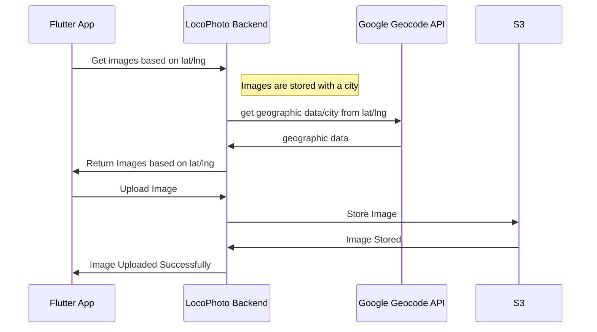

# LocoPhoto-Backend
Locophoto Backend  

https://apps.apple.com/ie/app/locophoto-leave-a-photo/id1516500110

https://play.google.com/store/apps/details?id=drop.image.locophoto&hl=en&gl=US

```mermaid
sequenceDiagram
Flutter App->>LocoPhoto Backend: Get images based on lat/lng
Note right of LocoPhoto Backend: Images are stored with a city 
LocoPhoto Backend->> Google Geocode API: get geographic data/city from lat/lng
Google Geocode API->> LocoPhoto Backend: geographic data 
LocoPhoto Backend->> Flutter App: Return Images based on lat/lng
Flutter App->>LocoPhoto Backend: Upload Image 
LocoPhoto Backend->>S3: Store Image 
S3->>LocoPhoto Backend: Image Stored
LocoPhoto Backend->> Flutter App: Image Uploaded Successfully
```
